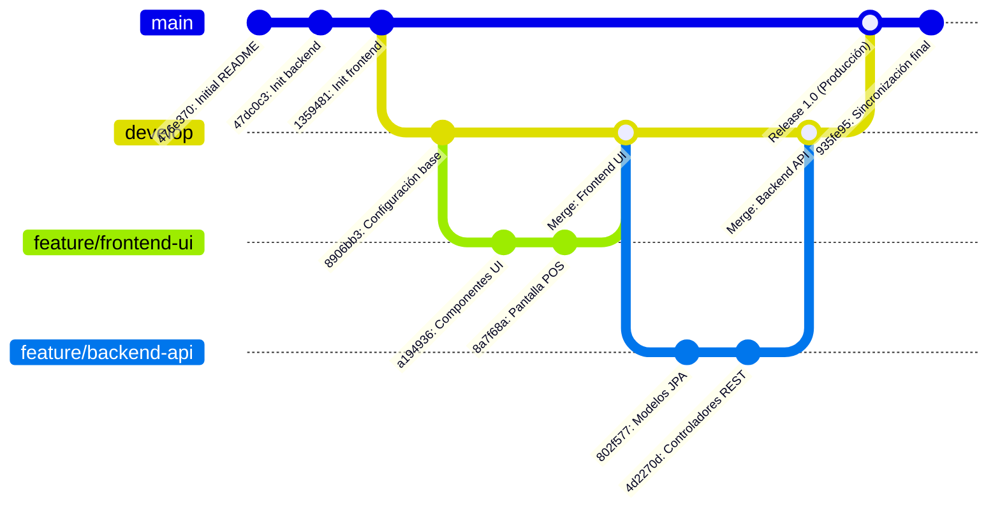

# Sistema de Gestión de Farmacia (SGF)

**Curso:** Herramientas de Desarrollo  
**Ciclo Académico:** 2026-2  
**Repositorio Oficial:** [https://github.com/TARRILLO-C/farmacia-java.git](https://github.com/TARRILLO-C/farmacia-java.git)

---

## Integrantes del Proyecto

| N° | Apellidos y Nombres | Código Universitario | Rol en el Proyecto |
|:--:|:--------------------|:--------------------:|:-------------------|
| 1 | Arroyo Vega, Carlos Felipe | U23214686 | Desarrollador Backend & QA |
| 2 | Bustamante Suclupe, Carlos Andres | U23211770 | Desarrollador Backend & DB Admin |
| 3 | Llapapasca Montes, Ronal James | U22221880 | Desarrollador Fullstack & DevOps |
| 4 | Niñan Gonzales, Danna Jael | U23214477 | Desarrolladora Frontend & UI/UX |
| 5 | Tarrillo Condor, Nigson Shrimi | U23224391 | Líder Técnico & Diseñador de Software |

---

# 8. GESTIÓN DE CONFIGURACIÓN Y CONTROL DE VERSIONES

## 8.1. Documentación Técnica en el Repositorio

El proyecto adopta una estructura desacoplada mediante un esquema de repositorio centralizado (*Monorepo organizado por dominios tecnológicos*), separando estrictamente la capa del servidor de aplicaciones de la capa de cliente web interactivo.

### 8.1.1. Arquitectura y Estructura Global del Directorio

```
farmacia-java/
├── .vscode/                               # Configuraciones de workspace compartidas para VS Code
├── backend/                               # Servidor de Servicios RESTful (Spring Boot 3 / Java 21)
│   ├── .mvn/wrapper/                      # Wrapper oficial de Apache Maven
│   ├── mvnw / mvnw.cmd                    # Scripts de ejecución portable de Maven sin instalación previa
│   ├── pom.xml                            # Descriptor de dependencias y plugins Maven
│   └── src/
│       ├── main/
│       │   ├── java/com/sg/farmacia/
│       │   │   ├── FarmaciaApplication.java  # Clase principal con anotación @SpringBootApplication
│       │   │   ├── config/                # Configuraciones de seguridad, CORS y beans globales
│       │   │   │   ├── CorsConfig.java    # Configuración de políticas de orígenes cruzados (WebMvcConfigurer)
│       │   │   │   └── SecurityConfig.java# Cadena de filtros de seguridad (Spring Security & JWT)
│       │   │   ├── controller/            # Controladores REST que exponen endpoints HTTP
│       │   │   │   ├── CategoriaController.java
│       │   │   │   ├── ClienteController.java
│       │   │   │   └── ProductoController.java
│       │   │   ├── dto/                   # Objetos de Transferencia de Datos (Request/Response DTOs)
│       │   │   │   ├── ApiResponse.java   # Envoltorio uniforme para respuestas HTTP
│       │   │   │   ├── categoria/         # CategoriaRequestDTO, CategoriaResponseDTO
│       │   │   │   ├── cliente/           # ClienteRequestDTO, ClienteResponseDTO
│       │   │   │   └── producto/          # ProductoRequestDTO, ProductoResponseDTO, AjusteStockRequestDTO
│       │   │   ├── exception/             # Manejo global y centralizado de excepciones
│       │   │   │   ├── BadRequestException.java
│       │   │   │   ├── ResourceNotFoundException.java
│       │   │   └── GlobalExceptionHandler.java (@ControllerAdvice)
│       │   │   ├── model/                 # Entidades persistentes mapeadas con JPA / Hibernate
│       │   │   │   ├── Categoria.java
│       │   │   │   ├── Cliente.java
│       │   │   │   ├── Producto.java
│       │   │   │   └── TipoCliente.java
│       │   │   ├── repository/            # Interfaces de persistencia de datos (Spring Data JPA)
│       │   │   │   ├── CategoriaRepository.java
│       │   │   │   ├── ClienteRepository.java
│       │   │   │   └── ProductoRepository.java
│       │   │   └── service/               # Lógica de negocio (Contratos e Implementaciones)
│       │   │       ├── CategoriaService.java
│       │   │       ├── ClienteService.java
│       │   │       ├── ProductoService.java
│       │   │       └── impl/              # Clases de implementación transaccional (@Service)
│       │   └── resources/
│       │       └── application.properties # Parámetros de conexión BD, puerto y configuración JPA
│       └── test/                          # Pruebas unitarias y de integración
│           └── java/com/sg/farmacia/
│               ├── FarmaciaApplicationTests.java
│               └── service/ProductoServiceTest.java
│
└── frontend/                              # Aplicación Web Reactiva (Next.js 16 / TypeScript / Tailwind)
    ├── package.json                       # Manifiesto de dependencias npm y scripts del cliente
    ├── tsconfig.json                      # Configuración de compilador TypeScript con path aliases (@/*)
    ├── next.config.ts                     # Configuración y optimizaciones del compilador de Next.js
    ├── components.json                    # Registro de componentes UI atómicos (Radix UI / Shadcn)
    ├── public/                            # Recursos estáticos e iconografía SVG
    └── src/
        ├── app/                           # Enrutamiento basado en sistema de archivos (App Router)
        │   ├── layout.tsx                 # Plantilla global raíz con fuentes y metaetiquetas
        │   ├── page.tsx                   # Página de aterrizaje o redirección inicial
        │   ├── login/page.tsx             # Pantalla de autenticación y control de acceso
        │   └── dashboard/                 # Panel de administración protegido
        │       ├── layout.tsx             # Shell del dashboard con Sidebar contextual y Header
        │       ├── page.tsx               # Resumen de métricas y KPIs de la farmacia
        │       ├── pos/page.tsx           # Módulo Punto de Venta (Dispensación ágil, caja y cobro)
        │       ├── productos/page.tsx     # Catálogo general de medicamentos y registro técnico
        │       ├── inventario/page.tsx    # Monitoreo de stock mínimo y alertas de lotes por vencer
        │       ├── clientes/page.tsx      # Directorio de clientes y gestión de "Cliente Amigo"
        │       ├── categorias/page.tsx    # Gestión y jerarquía de familias terapéuticas
        │       ├── ventas/page.tsx        # Historial de transacciones y opciones de anulación
        │       └── reportes/page.tsx      # Estadísticas de ventas y rotación de fármacos
        ├── components/                    # Biblioteca modular de componentes de interfaz
        │   ├── ui/                        # Componentes primitivos (button, input, card, drawer, etc.)
        │   ├── layout/                    # Header.tsx, Sidebar.tsx, HeaderContext.tsx
        │   ├── common/                    # AppDrawer.tsx (cajón corredizo con animaciones suaves)
        │   └── modules/                   # Modales de negocio (ProductoModal, ClienteModal, etc.)
        ├── services/                      # Clientes HTTP desacoplados basados en Axios
        │   ├── api.ts                     # Instancia central de Axios con baseUrl e interceptores
        │   ├── authService.ts             # Manejo de tokens de sesión JWT
        │   ├── productoService.ts         # Métodos de consumo para catálogo y stock
        │   ├── clienteService.ts          # Métodos de consulta y fidelización
        │   ├── categoriaService.ts        # Operaciones CRUD sobre familias de medicamentos
        │   └── ventaService.ts            # Transacciones POS y generación de recibos
        ├── types/                         # Definiciones de tipos e interfaces TypeScript compartidas
        └── hooks/                         # React custom hooks (ej. use-mobile.ts para diseño responsivo)
```

---

### 8.1.2. Ficha Técnica de Tecnologías y Versiones

| Entorno / Capa | Tecnología | Versión | Propósito en el Sistema |
|:---|:---|:---:|:---|
| **Lenguaje Backend** | Java Standard Edition | **21 LTS** | Núcleo del servidor, tipado estricto, virtual threads y alto rendimiento. |
| **Framework Backend** | Spring Boot | **3.x / 4.x** | Inyección de dependencias, arquitectura multicapa y configuración automática. |
| **Seguridad Backend** | Spring Security & JJWT | **0.11.5** | Control de acceso basado en roles (RBAC) y tokens web seguros. |
| **Persistencia** | Spring Data JPA / Hibernate | Oficial | Mapeo objeto-relacional (ORM) y consultas optimizadas a la base de datos. |
| **Base de Datos** | MySQL Server | **8.0+** | Almacenamiento persistente transaccional y relaciones referenciales ACID. |
| **Framework Frontend**| Next.js (App Router) | **16.x** | Renderizado del lado del cliente/servidor, Server Components y routing modular. |
| **Librería UI** | React | **19.x** | Construcción de interfaces reactivas y gestión declarativa del estado. |
| **Tipado Frontend** | TypeScript | **5.x** | Tipado estático de componentes, servicios e interfaces de datos. |
| **Estilos CSS** | Tailwind CSS | **4.x** | Diseño adaptativo, micro-animaciones y tokens de estilo optimizados. |
| **Cliente HTTP** | Axios | **1.7.9** | Peticiones asíncronas basadas en promesas hacia los endpoints del backend. |
| **Componentes UI** | Radix UI / Lucide React | **1.6+ / 0.475** | Accesibilidad estándar WAI-ARIA e iconografía moderna para farmacia. |

---

### 8.1.3. Guía de Instalación y Ejecución en Entorno Local

#### Prerrequisitos de Software:
1. **Java Development Kit (JDK):** Versión 21 instalada con la variable de entorno `JAVA_HOME` configurada.
2. **Node.js:** Versión 18 o superior con gestor de paquetes `npm`.
3. **Servidor MySQL:** Versión 8.0 en ejecución en el puerto local estándar `3306`.
4. **Git:** Herramienta de consola para control de versiones.

#### Paso 1: Clonar el Repositorio
```bash
git clone https://github.com/TARRILLO-C/farmacia-java.git
cd farmacia-java
```

#### Paso 2: Configuración y Arranque del Backend (Spring Boot)
1. Verificar los parámetros de conexión en [application.properties](file:///backend/src/main/resources/application.properties):
   ```properties
   spring.application.name=farmacia
   server.port=8080

   # Conexión a Base de Datos MySQL
   spring.datasource.url=jdbc:mysql://localhost:3306/farmacia_db?useSSL=false&serverTimezone=UTC&allowPublicKeyRetrieval=true
   spring.datasource.username=root
   spring.datasource.password=tu_contraseña

   # Hibernate JPA
   spring.jpa.hibernate.ddl-auto=update
   spring.jpa.show-sql=true
   spring.jpa.properties.hibernate.format_sql=true
   ```
2. Ejecutar el servidor con el wrapper de Maven:
   - **En Windows (PowerShell / CMD):**
     ```powershell
     cd backend
     .\mvnw.cmd spring-boot:run
     ```
   - **En Linux / macOS:**
     ```bash
     cd backend
     ./mvnw spring-boot:run
     ```
3. El servicio estará escuchando en `http://localhost:8080`.

#### Paso 3: Configuración y Arranque del Frontend (Next.js)
1. Abrir una nueva terminal y situarse en la carpeta del cliente:
   ```bash
   cd frontend
   ```
2. Instalar las dependencias del proyecto:
   ```bash
   npm install
   ```
3. Iniciar el servidor de desarrollo:
   ```bash
   npm run dev
   ```
4. Abrir en el navegador: [http://localhost:3000](http://localhost:3000).

---

### 8.1.4. Catálogo de Endpoints RESTful de la API

El backend expone una API REST organizada por entidades de dominio, retornando respuestas estructuradas en `ApiResponse<T>`:

| Método | Endpoint | Descripción | Parámetros / Body |
|:---:|:---|:---|:---|
| `GET` | `/api/productos` | Consulta el catálogo completo de medicamentos y productos | Query params opcionales de filtrado |
| `GET` | `/api/productos/{id}` | Obtiene el detalle de un producto por su clave primaria | Identificador `Long id` en ruta |
| `GET` | `/api/productos/codigo/{codigo}` | Búsqueda por código de barras para el lector POS | Código SKU/EAN en ruta |
| `POST`| `/api/productos` | Registra un nuevo medicamento en el inventario | `ProductoRequestDTO` (JSON) |
| `PUT` | `/api/productos/{id}` | Actualiza datos comerciales, stock mínimo o laboratorio | `id` en ruta y `ProductoRequestDTO` |
| `PATCH`| `/api/productos/{id}/stock` | Ajuste directo de existencias físicas en almacén | `AjusteStockRequestDTO` |
| `DELETE`| `/api/productos/{id}` | Baja lógica del producto (`activo = false`) | `Long id` en ruta |
| `GET` | `/api/clientes` | Obtiene el listado de clientes registrados | Ninguno |
| `GET` | `/api/clientes/buscar` | Búsqueda por documento nacional de identidad o RUC | `?doc=45892341` |
| `POST`| `/api/clientes` | Registra un nuevo cliente regular o "Cliente Amigo" | `ClienteRequestDTO` |
| `GET` | `/api/categorias` | Obtiene las familias y categorías farmacéuticas | Ninguno |
| `POST`| `/api/categorias` | Registra una nueva categoría de fármacos | `CategoriaRequestDTO` |

---

## 8.2. Estrategia de Ramificación y Registro de Cambios en Git

### 8.2.1. Modelo de Ramificación Adoptado (GitFlow Adaptado a Trabajo en Equipo)

El equipo aplica un flujo de trabajo estructurado basado en **Feature Branching** con ramas principales protegidas, garantizando un desarrollo colaborativo concurrente y ordenado.



#### Roles y Propósito de las Ramas:
1. **Rama `main` (Producción / Entregable Estable):**
   - Contiene únicamente versiones terminadas, funcionales y verificadas con pruebas unitarias.
   - El código debe compilar limpiamente en backend (`./mvnw test`) y frontend (`npm run build`).
2. **Rama `develop` (Integración Continua):**
   - Tronco común donde convergen las ramas de características para validar la interoperabilidad entre capas antes de la entrega final.
3. **Ramas de Características (`feature/<modulo>`):**
   - Ramas temporales creadas para desarrollar una tarea específica (ejemplo: `feature/modulo-pos`, `feature/cliente-amigo`).
   - Se integran hacia `develop` mediante Pull Requests evaluados por el equipo.
4. **Ramas de Corrección (`fix/<asunto>`):**
   - Destinadas a resolver incidencias específicas o solventar conflictos de integración entre ramas.

---

### 8.2.2. Políticas y Convenciones de Commits

El equipo estandariza los registros de cambios mediante la convención **Conventional Commits** y prefijos de contexto modular:

#### Estructura del Mensaje de Commit:
```
<tipo>(<alcance>): <descripción concisa en modo imperativo y minúsculas>
```

#### Clasificación de Tipos:
- `feat:` Nueva característica implementada para el usuario final (ej. `feat(pos): agregar calculo de descuento de cliente amigo`).
- `bk:` Ajuste o implementación específica en la capa backend (ej. `bk(controllers): agregar endpoint de ajuste de stock`).
- `fix:` Corrección de fallos o errores de ejecución (ej. `fix(drawer): corregir scroll interno y animacion`).
- `docs:` Modificaciones en documentación técnica o guías (ej. `docs: actualizar manual de instalacion y endpoints`).
- `refactor:` Optimización interna del código sin modificar su comportamiento externo (ej. `refactor(services): separar logica de negocio`).
- `test:` Pruebas unitarias o de integración automatizadas (ej. `test(producto): anadir pruebas para producto service`).
- `chore:` Tareas rutinarias de configuración o actualización de dependencias (ej. `chore(pom): actualizar dependencias`).

---

### 8.2.3. Registro Cronológico de Cambios del Repositorio (Changelog)

A continuación se detalla el historial de versiones del proyecto construido a partir de los commits consolidados del repositorio:

| Hash Commit | Autor | Fecha | Tipo | Resumen del Cambio Realizado |
|:---:|:---|:---:|:---:|:---|
| `476e370` | Jamesllm | 2026-08-20 | `docs` | Inicialización formal del repositorio con README base. |
| `1359481` | Jamesllm | 2026-08-27 | `feat` | Creación de la estructura base del proyecto cliente en Next.js. |
| `47dc0c3` | Jamesllm | 2026-08-27 | `feat` | Inicialización del servidor backend en Spring Boot con dependencias base. |
| `a194936` | Jamesllm | 2026-09-02 | `feat` | Creación e importación de componentes UI atómicos (botones, inputs, badges). |
| `728b2c0` | Jamesllm | 2026-09-02 | `feat` | Configuración de instancia cliente Axios e interceptores HTTP en frontend. |
| `80e04b0` | Jamesllm | 2026-09-02 | `feat` | Creación de modales de interacción para el módulo de Clientes. |
| `e699130` | Jamesllm | 2026-09-02 | `feat` | Implementación del componente de recibos y facturación de ventas. |
| `a9d0653` | Jamesllm | 2026-09-03 | `feat` | Construcción de la vista y filtros de inventario y semáforo de caducidad. |
| `8a7f68a` | Jamesllm | 2026-09-03 | `feat` | Maquetación interactiva de la pantalla de Punto de Venta (POS). |
| `627e559` | Jamesllm | 2026-09-06 | `bk` | Inclusión de dependencias críticas en `pom.xml`: Spring Security, MySQL, JWT y Validation. |
| `ac36357` | Jamesllm | 2026-09-06 | `bk` | Configuración de políticas CORS para permitir consumo seguro desde Next.js (`:3000`). |
| `4d2270d` | Jamesllm | 2026-09-06 | `bk` | Creación de controladores RESTful (`CategoriaController`, `ClienteController`). |
| `6d6befe` | Jamesllm | 2026-09-06 | `bk` | Definición de DTOs para solicitudes y respuestas con validación Jakarta. |
| `802f577` | Jamesllm | 2026-09-06 | `bk` | Mapeo de entidades JPA (`Producto`, `Categoria`, `Cliente`, `TipoCliente`). |
| `0b8ec4a` | Jamesllm | 2026-09-06 | `bk` | Creación de interfaces de servicio y lógica transaccional de negocio. |
| `21e3e67` | Jamesllm | 2026-09-06 | `bk` | Creación de interfaces `JpaRepository` con consultas personalizadas. |
| `ccb8d27` | Jamesllm | 2026-09-06 | `feat` | Modernización de la experiencia de usuario: migración de modales a Drawers animados. |
| `b9c0d0a` | Danna MG | 2026-09-09 | `docs` | Redacción de la documentación técnica inicial y especificaciones del sistema. |
| `bfd36bf` | Danna MG | 2026-09-09 | `docs` | Consolidación de la guía de control de versiones y estándares de colaboración. |
| `5af825b` | Carlos Arroyo | 2026-09-09 | `docs` | Registro complementario de cambios y validación de entregables. |
| `d035131` | Jamesllm | 2026-09-12 | `bk` | Actualización de endpoints de productos, ajuste de stock y pruebas unitarias con JUnit 5. |
| `935fe95` | Jamesllm | 2026-09-12 | `merge` | Fusión e integración de ramas entre repositorios remotos y locales. |

---

### 8.2.4. Protocolo de Gestión de Cambios, Pull Requests y Resolución de Conflictos

Con el objetivo de mantener la trazabilidad e integridad del repositorio al trabajar en equipo, se establece el siguiente protocolo estándar:

#### A. Flujo Diario de Trabajo en Git:
1. **Sincronizar el repositorio local antes de iniciar labores:**
   ```bash
   git checkout main
   git pull origin main
   ```
2. **Crear una rama de trabajo orientada a la funcionalidad:**
   ```bash
   git checkout -b feature/nombre-de-la-tarea
   ```
3. **Registrar cambios atómicos:**
   ```bash
   git add .
   git commit -m "feat(modulo): descripcion concisa del cambio"
   ```
4. **Publicar la rama en GitHub:**
   ```bash
   git push -u origin feature/nombre-de-la-tarea
   ```

#### B. Flujo de Pull Request (PR) y Code Review:
- Abrir un Pull Request en GitHub seleccionando la rama de destino correspondiente (`develop` o `main`).
- Asignar al menos a un compañero de equipo como revisor (*Reviewer*).
- Confirmar que las pruebas locales y la compilación no presenten fallas antes de realizar el merge.

#### C. Detección y Resolución de Conflictos de Fusión:
Si dos desarrolladores introducen cambios sobre el mismo archivo concurrentemente, se sigue el protocolo de resolución:

1. Traer los cambios más recientes de la rama base:
   ```bash
   git pull origin main
   ```
2. Git marcará los archivos con colisión. Localizar las marcas de conflicto:
   ```text
   <<<<<<< HEAD (Tus cambios locales)
   código o texto en tu rama local
   =======
   código o texto proveniente de la rama remota
   >>>>>>> origin/main
   ```
3. En VS Code, editar el archivo conservando la versión correcta y retirando los delimitadores (`<<<<<<<`, `=======`, `>>>>>>>`).
4. Marcar el archivo como resuelto y confirmar el commit de fusión:
   ```bash
   git add .
   git commit -m "fix(merge): resolver conflicto de integracion"
   git push origin feature/nombre-de-la-tarea
   ```
