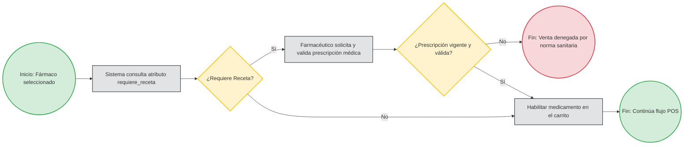
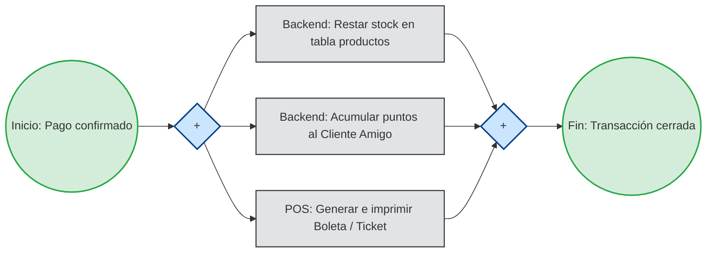
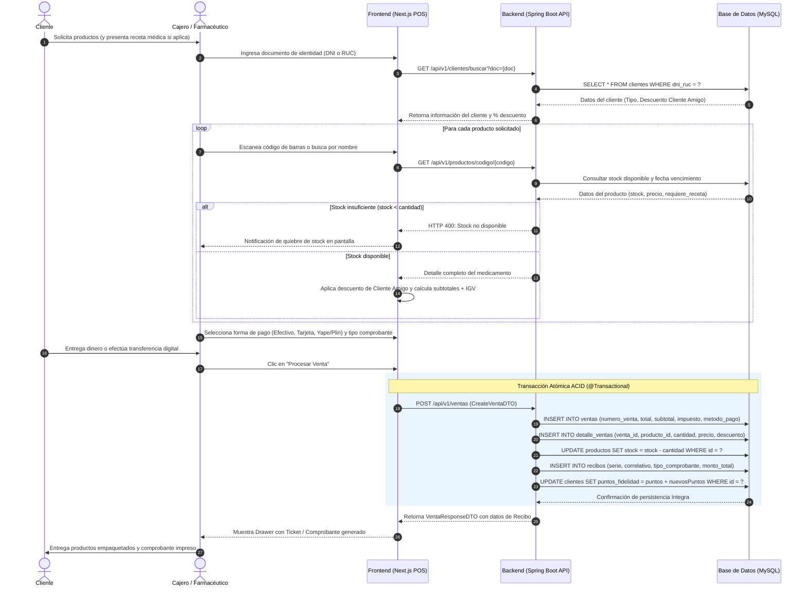
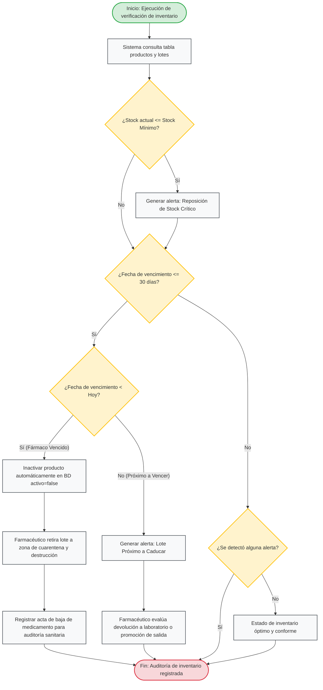
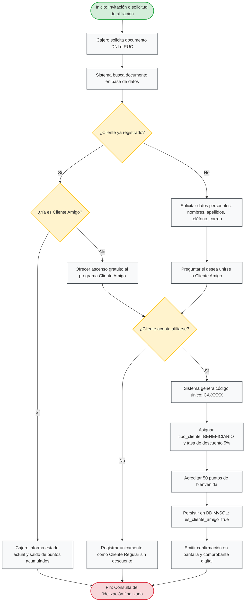
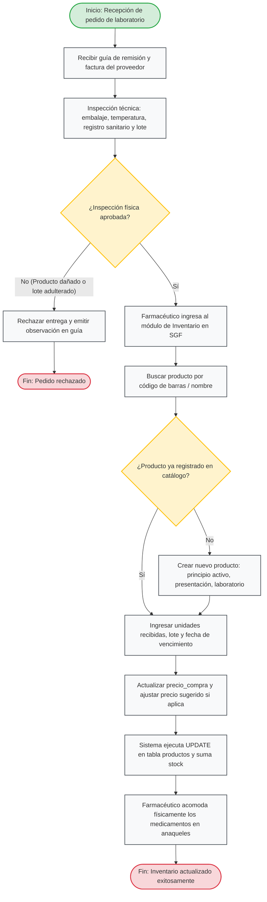
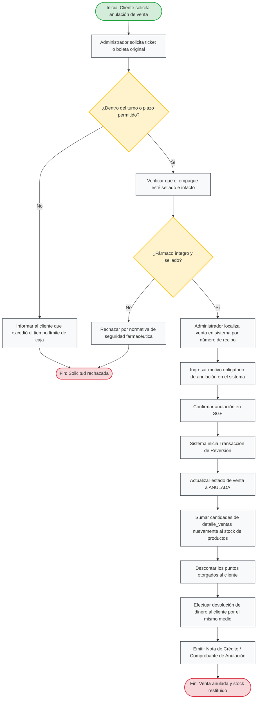

# Sistema de Gestión de Farmacia (SGF)

**Curso:** Herramientas de Desarrollo  
**Ciclo Académico:** 2026-2  
**Repositorio Oficial:** [https://github.com/TARRILLO-C/farmacia-java.git](https://github.com/TARRILLO-C/farmacia-java.git)

---

## Integrantes del Proyecto

| N° | Apellidos y Nombres | Código Universitario | Rol en el Proyecto |
|:--:|:--------------------|:--------------------:|:-------------------|
| 1 | Arroyo Vega, Carlos Felipe | U23214686 | Desarrollador Backend & QA |
| 2 | Bustamante Suclupe, Carlos Andres | U23211770 | Desarrollador Backend & DB Admin |
| 3 | Llapapasca Montes, Ronal James | U22221880 | Desarrollador Fullstack & DevOps |
| 4 | Niñan Gonzales, Danna Jael | U23214477 | Desarrolladora Frontend & UI/UX |
| 5 | Tarrillo Condor, Nigson Shrimi | U23224391 | Líder Técnico & Diseñador de Software |

---

# 3. Procesos de Negocio

La gestión por procesos es un pilar fundamental en la ingeniería de software moderna. En el **Sistema de Gestión de Farmacia (SGF)**, el modelado formal de los procesos de negocio permite comprender, estandarizar, automatizar y auditar las operaciones críticas del establecimiento de salud, garantizando la seguridad en la dispensación de fármacos, el cumplimiento de la normativa sanitaria y la eficiencia operativa.

---

## 3.1. Inclusión de Ejemplos y Explicaciones de la Notación BPM Utilizada

### 3.1.1. Fundamentos de BPM y BPMN 2.0
- **BPM (Business Process Management):** Disciplina de gestión integral que combina metodologías y tecnologías para diseñar, modelar, ejecutar, monitorear y optimizar los procesos de negocio de una organización.
- **BPMN (Business Process Model and Notation):** Estándar gráfico global promovido y administrado por el **Object Management Group (OMG)**. Su versión 2.0 proporciona un lenguaje visual universal y riguroso que sirve de puente de entendimiento tanto para los analistas de negocio y usuarios operativos (cajeros, farmacéuticos) como para los desarrolladores de software y arquitectos de TI.

---

### 3.1.2. Elementos Estándar de la Notación BPMN 2.0

Para el diseño de los procesos de la farmacia se han implementado las siguientes categorías de elementos de la especificación BPMN 2.0:

#### A. Canales y Participantes (Swimlanes)
Delimitan los límites organizacionales y las responsabilidades operativas en el flujo:
1. **Piscinas (Pools):** Representan un participante mayor o un proceso autónomo (ejemplo: *Establecimiento Farmacéutico*, *Cliente*, *Entidad Reguladora / SUNAT*).
2. **Carriles (Lanes):** Subparticiones dentro de una piscina que representan roles o subsistemas específicos:
   - **Carril Cliente:** El usuario que solicita y abona los medicamentos.
   - **Carril Cajero / Farmacéutico:** El profesional responsable de la atención al público, validación de recetas médicas y cobro.
   - **Carril Sistema SGF (Frontend / Backend):** Los módulos informáticos automatizados encargados de validar stock, aplicar descuentos, registrar comprobantes y persistir datos.

#### B. Objetos de Flujo (Flow Objects)
Son los componentes gráficos primarios que definen el comportamiento del proceso:

| Elemento BPMN | Notación Visual | Semántica y Uso en el Sistema de Farmacia | Ejemplo Concreto en el SGF |
|:---|:---:|:---|:---|
| **Evento de Inicio (Start Event)** | Círculo con borde fino simple | Disparador o detonante que da comienzo al proceso de negocio. No contiene flujos entrantes. | *Cliente se acerca al mostrador solicitando medicamentos.* |
| **Evento Intermedio (Intermediate Event)** | Círculo con doble borde | Ocurrencia que sucede entre el inicio y el fin del flujo, afectando su curso sin terminarlo. | *Recepción de confirmación de pago digital (Yape/Plin).* |
| **Evento de Fin (End Event)** | Círculo con borde grueso oscuro | Señala la culminación y el resultado final alcanzado por el flujo de trabajo. | *Venta completada y comprobante emitido exitosamente.* |
| **Tarea de Usuario (User Task)** | Rectángulo redondeado con icono de persona | Actividad que realiza un operador humano con la asistencia directa del software. | *Cajero escanea el código de barras e ingresa la cantidad.* |
| **Tarea de Servicio (Service Task)** | Rectángulo redondeado con icono de engranajes | Actividad 100% automatizada ejecutada por el sistema informático sin intervención humana. | *Backend calcula descuento por Cliente Amigo y resta stock.* |
| **Tarea Manual (Manual Task)** | Rectángulo redondeado con icono de mano | Actividad puramente física ejecutada por una persona fuera del alcance del sistema. | *Farmacéutico ubica físicamente el jarabe en la estantería.* |
| **Compuerta Exclusiva (Exclusive Gateway - XOR)** | Rombo con o sin símbolo "X" | Punto de decisión donde se evalúan condiciones mutuamente excluyentes; **solo una** rama puede ejecutarse. | *¿El medicamento requiere receta médica obligatoria? (Sí / No).* |
| **Compuerta Paralela (Parallel Gateway - AND)** | Rombo con símbolo "+" | Punto de bifurcación donde **todas** las ramas concurrentes se inician simultáneamente, o donde convergen todas para sincronizar. | *Imprimir ticket de venta Y descontar stock en base de datos al mismo tiempo.* |
| **Compuerta Inclusiva (Inclusive Gateway - OR)** | Rombo con círculo interno | Permite que una o múltiples ramas concurrentes sean ejecutadas dependiendo de condiciones no excluyentes. | *Aplicar descuento por cupón promocional Y/O descuento por puntos acumulados.* |

#### C. Objetos de Conexión (Connecting Objects) y Datos
- **Flujo de Secuencia (Sequence Flow):** Flecha sólida continua que establece el orden estricto de ejecución de las tareas dentro de un mismo carril/piscina.
- **Flujo de Mensaje (Message Flow):** Flecha segmentada con círculo de origen que representa la comunicación entre dos piscinas independientes (ejemplo: envío del comprobante digital al correo del cliente).
- **Almacén de Datos (Data Store):** Representa un repositorio persistente de información que trasciende la instancia del proceso (ejemplo: tabla `productos` o `ventas` en la base de datos MySQL).

---

### 3.1.3. Ejemplos Didácticos de la Notación BPMN

#### Ejemplo 1: Compuerta Exclusiva (XOR) - Decisión de Receta Médica
Representa una bifurcación obligatoria donde se evalúa si el fármaco seleccionado exige prescripción médica según el marco de la DIGEMID:

#### Ejemplo 2: Compuerta Paralela (AND) - Ejecución Concurrente al Confirmar Venta
Al momento de cerrar la transacción, el sistema dispara concurrentemente la actualización del inventario y la emisión de los comprobantes fiscales:

---

## 3.2. Identificación y Modelado de los Procesos de Negocio Relevantes

Se han identificado, estructurado y modelado los **cinco (5) procesos de negocio fundamentales** que gobiernan el ciclo de vida operativo del Sistema de Gestión de Farmacia:

1. **Proceso 01 (Core):** Venta en Mostrador / Punto de Venta (POS) y Facturación.
2. **Proceso 02 (Soporte Crítico):** Control de Inventario, Alertas de Stock Mínimo y Caducidad de Medicamentos.
3. **Proceso 03 (Comercial / CRM):** Registro, Afiliación y Fidelización ("Cliente Amigo").
4. **Proceso 04 (Abastecimiento):** Recepción e Ingreso de Mercadería y Lotes Farmacéuticos.
5. **Proceso 05 (Postventa):** Devolución y Anulación de Venta con Reincorporación de Stock.

---

### 3.2.1. Proceso 01: Venta en Mostrador / Punto de Venta (POS) y Facturación

#### Ficha Técnica del Proceso
- **Identificador:** PN-01
- **Nombre:** Proceso de Atención y Venta en Punto de Venta (POS)
- **Tipo de Proceso:** Clave / Operativo (*Core Business*)
- **Disparador (Trigger):** Cliente solicita compra de medicamentos o productos sanitarios en caja/mostrador.
- **Actores involucrados:** Cliente, Cajero / Farmacéutico, Sistema SGF (Next.js + Spring Boot API + MySQL).
- **Resultado Esperado:** Entrega de medicamentos conformes, actualización atómica del inventario en base de datos y emisión del comprobante tributario (Boleta/Factura/Ticket).

#### Diagrama de Secuencia e Interacción de la Arquitectura
El siguiente diagrama detalla la orquestación entre la capa de presentación, los servicios de negocio de Spring Boot y el motor transaccional de MySQL:

#### Diagrama BPMN 2.0 (Carriles de Responsabilidad - Swimlanes)

```mermaid
flowchart TD
    subgraph Pool_Farmacia["Piscina: Proceso Integral de Venta y Facturación POS"]
        subgraph Lane_Cliente["Carril: Cliente"]
            C_Start([Inicio: Solicita compra de medicamentos]) --> C_Presenta[Presenta DNI/RUC y receta médica]
            C_Paga[Realiza pago: Efectivo, Tarjeta o QR Yape/Plin]
            C_Recibe[Recibe medicamentos y comprobante de venta] --> C_End([Fin: Compra completada])
        end

        subgraph Lane_Cajero["Carril: Cajero / Farmacéutico"]
            C_Presenta --> K_IdCliente[Ingresar documento del cliente en sistema POS]
            K_Escanear[Escanear código de barras o ingresar nombre de medicamento]
            K_ValidaReceta{¿Fármaco exige receta?}
            K_VerifReceta[Verificar vigencia, firma y sello médico de la receta]
            K_RecetaValida{¿Receta conforme?}
            K_Rechazar[Informar restricción sanitaria y retirar ítem]
            K_Cobrar[Seleccionar medio de pago y solicitar importe al cliente]
            K_Despachar[Empaquetar fármacos y entregar junto al comprobante]
        end

        subgraph Lane_Sistema["Carril: Sistema SGF (Frontend Next.js + Backend Spring Boot + MySQL)"]
            K_IdCliente --> S_BuscaCli[Consultar cliente en BD]
            S_BuscaCli --> S_AplicaDesc[Identificar categoría y calcular % descuento Cliente Amigo]
            S_AplicaDesc --> K_Escanear
            K_Escanear --> S_VerifStock[Verificar stock disponible y vigencia en BD]
            S_VerifStock --> S_HayStock{¿Stock suficiente?}
            S_HayStock -- No --> S_AvisaStock[Emitir alerta: Stock insuficiente y sugerir genérico]
            S_AvisaStock --> K_Escanear
            S_HayStock -- Sí --> K_ValidaReceta
            
            K_ValidaReceta -- Sí --> K_VerifReceta
            K_ValidaReceta -- No --> S_AgregaCarrito[Agregar ítem al carrito y recalcular subtotal + IGV]
            K_VerifReceta --> K_RecetaValida
            K_RecetaValida -- No --> K_Rechazar
            K_RecetaValida -- Sí --> S_AgregaCarrito
            
            S_AgregaCarrito --> S_MasItems{¿Desea agregar más productos?}
            S_MasItems -- Sí --> K_Escanear
            S_MasItems -- No --> K_Cobrar
            
            K_Cobrar --> C_Paga
            C_Paga --> S_TxVenta[Iniciar Transacción Atómica ACID]
            S_TxVenta --> S_DescuentaStock[Restar unidades del inventario]
            S_DescuentaStock --> S_GuardaVenta[Insertar registro en tabla ventas y detalle_ventas]
            S_GuardaVenta --> S_GeneraRecibo[Crear comprobante con numeración correlativa]
            S_GeneraRecibo --> S_SumaPuntos[Actualizar puntos de fidelidad en cliente]
            S_SumaPuntos --> S_Imprime[Enviar comprobante a impresión/pantalla]
            S_Imprime --> K_Despachar
            K_Despachar --> C_Recibe
        end
    end

    classDef event fill:#d4edda,stroke:#28a745,stroke-width:2px;
    classDef endEvent fill:#f8d7da,stroke:#dc3545,stroke-width:2px;
    classDef task fill:#f8f9fa,stroke:#495057,stroke-width:1.5px;
    classDef gateway fill:#fff3cd,stroke:#ffc107,stroke-width:2px;

    class C_Start event;
    class C_End endEvent;
    class C_Presenta,C_Paga,C_Recibe,K_IdCliente,K_Escanear,K_VerifReceta,K_Rechazar,K_Cobrar,K_Despachar,S_BuscaCli,S_AplicaDesc,S_VerifStock,S_AvisaStock,S_AgregaCarrito,S_TxVenta,S_DescuentaStock,S_GuardaVenta,S_GeneraRecibo,S_SumaPuntos,S_Imprime task;
    class K_ValidaReceta,K_RecetaValida,S_HayStock,S_MasItems gateway;
```

---

### 3.2.2. Proceso 02: Control de Inventario, Alertas de Stock Mínimo y Caducidad

#### Ficha Técnica del Proceso
- **Identificador:** PN-02
- **Nombre:** Proceso de Supervisión de Inventario y Control de Caducidad de Medicamentos
- **Tipo de Proceso:** Soporte / Aseguramiento de la Calidad
- **Disparador (Trigger):** Rutina programada del sistema o inspección manual periódica del farmacéutico regente.
- **Actores involucrados:** Farmacéutico Regente, Sistema SGF, Proveedores / Laboratorios.
- **Resultado Esperado:** Garantizar la ausencia de medicamentos vencidos en los estantes de venta y la reposición oportuna de stock crítico.

#### Diagrama BPMN 2.0 (Flujo de Decisión de Inventario)

---

### 3.2.3. Proceso 03: Registro, Afiliación y Fidelización ("Cliente Amigo")

#### Ficha Técnica del Proceso
- **Identificador:** PN-03
- **Nombre:** Proceso de Afiliación y Fidelización de Clientes
- **Tipo de Proceso:** Estratégico / Comercial
- **Disparador (Trigger):** Cliente solicita registrarse o cajero invita al cliente a afiliarse al programa durante una compra.
- **Actores involucrados:** Cliente, Cajero, Sistema SGF.
- **Resultado Esperado:** Cliente dado de alta en el sistema con código único de *Cliente Amigo*, tasa de descuento asignada y monedero de puntos activado.

#### Diagrama BPMN 2.0 (Flujo de Fidelización)

---

### 3.2.4. Proceso 04: Abastecimiento y Recepción de Medicamentos

#### Ficha Técnica del Proceso
- **Identificador:** PN-04
- **Nombre:** Proceso de Ingreso de Fármacos y Control de Recepción Técnica
- **Tipo de Proceso:** Operativo / Abastecimiento
- **Disparador (Trigger):** Llegada de orden de compra desde distribuidora farmacéutica con guía de remisión.
- **Actores involucrados:** Transportista de Proveedor, Farmacéutico Regente, Sistema SGF.
- **Resultado Esperado:** Mercadería ingresada al inventario del sistema con número de lote, fecha de vencimiento y costos de adquisición actualizados.

#### Diagrama BPMN 2.0 (Recepción Técnica y Carga en Inventario)

---

### 3.2.5. Proceso 05: Devolución y Anulación de Ventas con Reincorporación de Stock

#### Ficha Técnica del Proceso
- **Identificador:** PN-05
- **Nombre:** Proceso de Anulación de Venta y Reintegro de Medicamentos
- **Tipo de Proceso:** Postventa / Auditoría
- **Disparador (Trigger):** Cliente solicita devolución por error de compra o reclamo justificado con comprobante físico.
- **Actores involucrados:** Cliente, Administrador / Supervisor, Sistema SGF.
- **Resultado Esperado:** Venta marcada como `ANULADA`, reincorporación física y lógica del stock y devolución del importe al cliente.

#### Diagrama BPMN 2.0 (Anulación y Reversión Atómica)

---

## 3.3. Síntesis y Matriz de Trazabilidad de los Procesos de Negocio

La siguiente matriz correlaciona cada proceso de negocio modelado con los componentes de software (Frontend y Backend) implementados en el repositorio:

| Código Proceso | Nombre del Proceso | Tipo BPMN | Componentes Frontend (Next.js) | Componentes Backend (Spring Boot) | Tablas Afectadas (MySQL) |
|:---:|:---|:---:|:---|:---|:---|
| **PN-01** | Venta en Mostrador (POS) y Facturación | Core / Operativo | `app/dashboard/pos/page.tsx` `components/modules/ventas/ReciboModal.tsx` `services/ventaService.ts` | `VentaController.java` `VentaServiceImpl.java` `SecurityConfig.java` | `ventas` `detalle_ventas` `productos` `recibos` `clientes` |
| **PN-02** | Control de Inventario y Alertas de Caducidad | Soporte Crítico | `app/dashboard/inventario/page.tsx` `app/dashboard/productos/page.tsx` `services/productoService.ts` | `ProductoController.java` `ProductoServiceImpl.java` | `productos` `categorias` |
| **PN-03** | Afiliación y Fidelización ("Cliente Amigo") | Estratégico / CRM | `app/dashboard/clientes/page.tsx` `components/modules/clientes/ClienteModal.tsx` `services/clienteService.ts` | `ClienteController.java` `ClienteServiceImpl.java` | `clientes` |
| **PN-04** | Abastecimiento y Recepción de Medicamentos | Operativo / Compras | `app/dashboard/productos/page.tsx` `components/modules/productos/ProductoModal.tsx` | `ProductoController.java` `CategoriaController.java` | `productos` `categorias` |
| **PN-05** | Devolución y Anulación de Ventas | Postventa / Auditoría | `app/dashboard/ventas/page.tsx` `services/ventaService.ts (anularVenta)` | `VentaController.java (anular)` `VentaServiceImpl.java` | `ventas` `detalle_ventas` `productos` `clientes` |